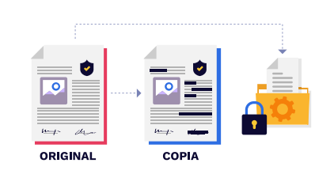

# Anonimización de Datos

¿Qué es el big data?

¿Qué es y para que se usa el análisis de datos?

-decisión (ejemplo) control de gastos empresa X o personales.

¿Qué piensan que es la anonimización de datos?

¿Porqué es importante la anonimización de datos?

## Introducción

En el marco de la Política Nacional de Explotación de Datos CONPES
3920 de 2018 (Consejo Nacional de Política Económica y Social -
CONPES, 2018) y la Política de Transformación Digital e Inteligencia
Artificial CONPES 3975 de 2019, se reconoce el potencial que
tienen los datos como activo para la generación de valor social y
económico. Por tal motivo, uno de sus objetivos es que las entidades
masifiquen la disponibilidad de datos públicos digitales accesibles,
usables y de calidad. En ese sentido, se identifica la necesidad de
fortalecer la apertura de datos para su reutilización, salvaguardando los
principios reconocidos por la legislación en materia de transparencia y
protección de datos personales.

    * Guía de Anonimización de Datos Estructurados - Conceptos generales y propuesta metodológica - Archivo general de la nacion

## Introducción Real

La anonimización es un proceso por el cuál se altera un conjunto de datos para que no se pueda identificar a una persona, pero sin que pierda validez en aras de poder el análisis deseado correctamente.

## Ejemplo Ilustrativo

**Se requiere hacer un estudio de cuántas mujeres usan vestido verde en un grupo poblacional de una empresa X**

    Note que en esta imágen podemos ver todos los datos de nuestro grupo de muestra, Nombre color de Camisa y cada una tiene una hoja al lado con más información.

**¿Cómo podríamos Resolver la pregunta inicial, sin tener que darnos cuenta quién es quién?**

    Las bases de datos de toda esta información son como archivos de excel organizados.

**La podríamos ver de una manera más formal**

### Reflexionemos
    ¿Qué diferencia o similitudes habría entre la anonimización de datos, y la actividad de seguimiento de un proceso judicial?
Para Leonardo: individualización, anonimato, colectividad
### Otros ejemplos más completos información estructurada.

También puedo tener técnicas de generalización

#### No estructurados

## Desarrollo

La anonimización de datos implica la transformación de los datos originales de manera que sea imposible identificar a las personas a las que pertenecen. Esto se logra mediante técnicas como la supresión de identificadores únicos, la agregación de datos, la generalización de atributos sensibles y el enmascaramiento de información personal.

Existen diferentes métodos y algoritmos para llevar a cabo la anonimización de datos, como el k-anonimato, el l-diversidad y el t-closeness. Estos enfoques buscan equilibrar la utilidad de los datos para su análisis con la protección de la privacidad de los individuos.

Es importante tener en cuenta que la anonimización de datos no garantiza una protección absoluta. Con el avance de las técnicas de análisis y la interconexión de diferentes fuentes de datos, es posible que se pueda reidentificar a las personas incluso después de haber sido anonimizadas. Por lo tanto, es fundamental implementar medidas adicionales de seguridad y cumplir con las regulaciones y estándares de privacidad vigentes.

## Conclusión

La anonimización de datos es una práctica esencial en el ámbito de la protección de la privacidad. Permite utilizar y compartir datos de manera segura, minimizando el riesgo de divulgación de información personal. Sin embargo, es importante recordar que la anonimización no es una solución infalible y que se deben implementar otras medidas de seguridad para garantizar la protección de los datos.

En resumen, la anonimización de datos es un proceso clave para preservar la privacidad en un mundo cada vez más digitalizado. Al aplicar técnicas adecuadas de anonimización y cumplir con las regulaciones de privacidad, podemos aprovechar los beneficios de los datos sin comprometer la confidencialidad de las personas involucradas.

¿Qué es la protección de datos?
